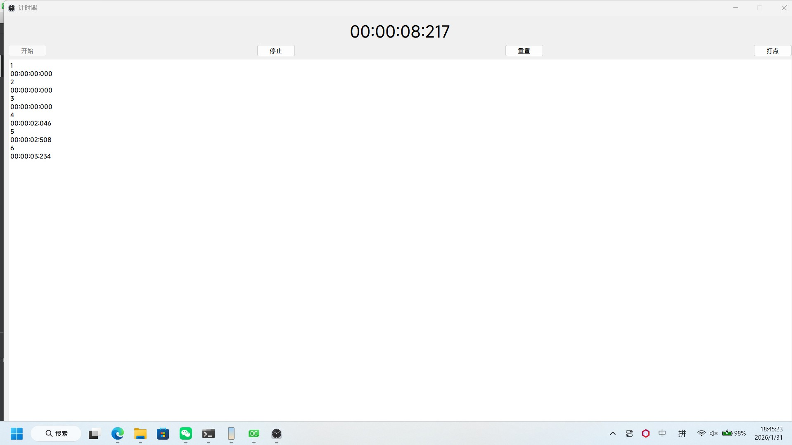
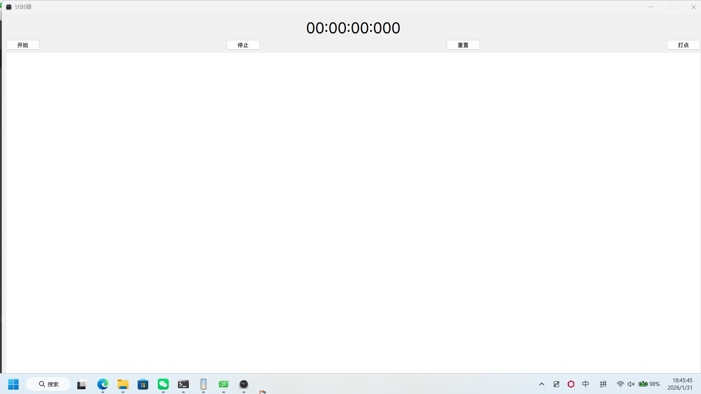

# 基于QT5.11 C++ 计时器项目总结

## 一、程序界面



## 二、 项目简要建设过程
1.  **项目初始化**：创建QT Widgets Application项目，指定QT5.11编译环境，生成核心的`Widget`类（包含`.h`头文件和`.cpp`源文件）。
2.  **界面搭建**：通过QT Designer设计可视化界面，添加时间显示框（`ShowTimeEdit`）、计次记录框（`BitEdit`）、开始按钮（`StartButton`）、停止按钮（`StopButton`）、重置按钮（`ResetButton`）、计次按钮（`BitButton`）。
3.  **核心逻辑开发**：引入`QTimer`（定时器）、`QTime`（时间处理）类，实现计时器的启动、停止、重置、计次记录、全屏显示等核心功能。
4.  **信号与槽关联**：通过`connect`函数关联定时器超时信号与自定义槽函数，以及各按钮的点击信号与对应的处理槽函数，实现界面交互与逻辑联动。
5.  **测试与优化**：编译运行项目，验证各功能的完整性和稳定性，调整定时器刷新间隔，优化界面显示效果与用户操作体验。

## 三、 核心代码原型、参考代码及用法（列表形式）
### 1.  类构造与析构相关
-   **函数原型**：`explicit Widget(QWidget *parent = 0);`
-   **参考代码**：
    ```cpp
    Widget::Widget(QWidget *parent) : QWidget(parent), ui(new Ui::Widget)
    {
        ui->setupUi(this);
        connect(&timer, SIGNAL(timeout()), this, SLOT(timeout_Slot()));
        setWindowTitle("计时器");
        time.setHMS(0, 0, 0, 0);
        ui->ShowTimeEdit->setText("00:00:00:000");
    }
    ```
-   **函数用法**：
    1.  作为`Widget`类的构造函数，创建`Widget`实例时自动调用，`parent = 0`表示该窗口无父窗口，是独立顶层窗口。
    2.  初始化UI界面对象，调用`ui->setupUi(this)`加载QT Designer设计的界面布局与控件。
    3.  关联定时器`timer`的`timeout()`超时信号与自定义槽函数`timeout_Slot()`，建立定时触发的逻辑关联。
    4.  设置窗口标题为“计时器”，让用户清晰识别窗口功能。
    5.  初始化`QTime`时间对象为0时0分0秒0毫秒，通过`setHMS()`方法设置初始时间值。
    6.  给界面上的时间显示框`ShowTimeEdit`设置初始显示文本“00:00:00:000”，保证界面初始化状态统一。
    7.  获取屏幕可用区域尺寸，设置窗口为全屏固定尺寸，实现全屏显示效果，提升视觉体验。

-   **函数原型**：`~Widget();`
-   **参考代码**：
    ```cpp
    Widget::~Widget()
    {
        delete ui;
    }
    ```
-   **函数用法**：
    1.  作为`Widget`类的析构函数，当`Widget`实例被销毁时自动调用，负责释放类占用的动态资源。
    2.  释放`Ui::Widget`类型的动态对象`ui`，该对象是通过`new`关键字在构造函数中创建的，若不手动释放会造成内存泄漏。
    3.  确保UI界面相关的控件资源、布局资源被正常回收，避免程序退出后残留无效内存占用。

### 2.  定时器超时核心处理
-   **函数原型**：`void timeout_Slot();`
-   **参考代码**：
    ```cpp
    void Widget::timeout_Slot()
    {
        time = time.addMSecs(33);
        ui->ShowTimeEdit->setText(time.toString("hh:mm:ss:zzz"));
    }
    ```
-   **函数用法**：
    1.  这是自定义的私有槽函数，仅能响应关联的信号触发，无法被外部直接调用。
    2.  当定时器`timer`启动后，每隔设定的时间间隔（30毫秒）会触发`timeout()`信号，进而调用该槽函数。
    3.  调用`QTime`的`addMSecs(33)`方法，给当前时间对象`time`累加33毫秒，实现计时器的时间推进（选择33毫秒是为了让显示更接近平滑刷新，弥补定时器系统误差）。
    4.  调用`QTime`的`toString("hh:mm:ss:zzz")`方法，将时间对象格式化为“时:分:秒:毫秒”的字符串格式，满足用户直观查看时间的需求。
    5.  将格式化后的时间字符串设置到界面的`ShowTimeEdit`显示框中，实现时间的实时更新展示。

### 3.  开始按钮交互处理
-   **函数原型**：`void on_StartButton_clicked();`
-   **参考代码**：
    ```cpp
    void Widget::on_StartButton_clicked()
    {
        timer.start(30);
        ui->StartButton->setEnabled(false);
        isstop = 0;
    }
    ```
-   **函数用法**：
    1.  这是QT自动关联的按钮点击槽函数，命名遵循`on_控件名_信号名()`的规范，无需手动调用`connect`即可关联按钮的`clicked()`点击信号。
    2.  当用户点击界面上的“开始”按钮（`StartButton`）时，自动触发该函数。
    3.  调用`QTimer`的`start(30)`方法，启动定时器并设置超时间隔为30毫秒，定时器开始周期性触发`timeout()`信号。
    4.  调用`ui->StartButton->setEnabled(false)`，将开始按钮设置为禁用状态，防止用户重复点击开始按钮造成定时器多次启动，避免逻辑混乱。
    5.  将全局状态变量`isstop`赋值为0，标记计时器当前处于“运行中”状态，为其他功能（如计次、停止）提供状态判断依据。

### 4.  停止按钮交互处理
-   **函数原型**：`void on_StopButton_clicked();`
-   **参考代码**：
    ```cpp
    void Widget::on_StopButton_clicked()
    {
        timer.stop();
        ui->StartButton->setEnabled(true);
        isstop = 1;
    }
    ```
-   **函数用法**：
    1.  遵循QT控件信号自动关联规范的槽函数，响应“停止”按钮（`StopButton`）的`clicked()`点击信号。
    2.  当用户点击停止按钮时，自动触发该函数，实现计时器的暂停功能。
    3.  调用`QTimer`的`stop()`方法，停止定时器的运行，定时器不再触发`timeout()`信号，计时器时间停止推进。
    4.  调用`ui->StartButton->setEnabled(true)`，将开始按钮恢复为启用状态，允许用户后续再次点击开始按钮，继续推进计时器。
    5.  将全局状态变量`isstop`赋值为1，标记计时器当前处于“已停止”状态，为后续计次、重置等功能提供状态判断依据。

### 5.  重置按钮交互处理
-   **函数原型**：`void on_ResetButton_clicked();`
-   **参考代码**：
    ```cpp
    void Widget::on_ResetButton_clicked()
    {
        timer.stop();
        time.setHMS(0, 0, 0, 0);
        ui->ShowTimeEdit->setText("00:00:00:000");
        ui->BitEdit->clear();
        i = 0;
        ui->StartButton->setEnabled(true);
        isstop = 1;
    }
    ```
-   **函数用法**：
    1.  遵循QT自动关联规范的槽函数，响应“重置”按钮（`ResetButton`）的`clicked()`点击信号，实现计时器的一键恢复初始状态功能。
    2.  首先调用`timer.stop()`停止定时器运行，无论计时器当前是运行中还是已停止，都先终止定时逻辑，避免重置过程中时间继续推进。
    3.  调用`time.setHMS(0, 0, 0, 0)`，将时间对象`time`恢复为初始的零值状态（时、分、秒、毫秒均为0）。
    4.  将时间显示框`ShowTimeEdit`的文本重置为“00:00:00:000”，让界面显示与时间对象状态保持一致。
    5.  调用`ui->BitEdit->clear()`清空计次记录框`BitEdit`中的所有内容，删除之前的所有计次序号和时间记录。
    6.  将计次序号变量`i`重置为0，为后续新的计次操作重新计数。
    7.  启用开始按钮`StartButton`，允许用户重新开始计时操作。
    8.  将状态变量`isstop`赋值为1，标记计时器处于“已停止/初始”状态，确保后续功能逻辑判断准确。

### 6.  计次按钮交互处理
-   **函数原型**：`void on_BitButton_clicked();`
-   **参考代码**：
    ```cpp
    void Widget::on_BitButton_clicked()
    {
        QString temp;
        i = i + 1;
        temp.sprintf("%d", i);
        ui->BitEdit->append(temp);
        ui->BitEdit->append(time.toString("hh:mm:ss:zzz"));
    }
    ```
-   **函数用法**：
    1.  遵循QT自动关联规范的槽函数，响应“计次”按钮（`BitButton`）的`clicked()`点击信号，实现当前计时器时间的记录功能。
    2.  当用户点击计次按钮时，自动触发该函数，无论计时器是运行中还是已停止，都可记录当前时间。
    3.  首先将计次序号变量`i`进行自增操作（`i = i + 1`），实现计次序号的连续累加，区分不同次数的记录。
    4.  定义`QString`类型变量`temp`，用于存储格式化后的计次序号字符串。
    5.  调用`sprintf("%d", i)`将整型计次序号`i`格式化为字符串，存入`temp`变量中，便于在界面控件中显示。
    6.  调用`ui->BitEdit->append(temp)`，将计次序号字符串追加到计次记录框`BitEdit`中，实现序号的换行显示。
    7.  调用`time.toString("hh:mm:ss:zzz")`格式化当前时间，并通过`append()`方法追加到计次记录框中，与计次序号一一对应，方便用户查看每次记录的时间点。
    8.  根据`isstop`状态变量的值，判断计时器当前状态，动态更新开始按钮的可用状态：若处于停止状态，启用开始按钮；若处于运行状态，禁用开始按钮，保证操作逻辑的一致性。

### 7.  核心成员变量与全局变量
-   **变量原型**：`QTimer timer;`、`QTime time;`、`static int i, isstop = 0;`
-   **参考代码**：
    ```cpp
    // 类内私有成员变量
    QTimer timer;
    QTime time;
    // 全局静态变量
    static int i, isstop = 0;
    ```
-   **变量用法**：
    1.  `QTimer timer`：
        -  属于`Widget`类的成员变量，生命周期与`Widget`实例一致，专门用于提供定时触发功能，是计时器推进的核心驱动。
        -  支持`start(间隔)`、`stop()`等方法，可控制定时逻辑的启动与停止，通过`timeout()`信号关联业务处理槽函数。
        -  本项目中设置30毫秒间隔，用于周期性更新计时器时间，实现时间的平滑推进。
    2.  `QTime time`：
        -  属于`Widget`类的成员变量，用于存储和处理计时器的时间数据，支持时、分、秒、毫秒的精准操作。
        -  提供`setHMS()`方法设置初始时间、`addMSecs()`方法累加毫秒数、`toString()`方法格式化时间字符串等核心功能。
        -  本项目中初始化为0时0分0秒0毫秒，运行过程中每次累加33毫秒，最终格式化后展示在界面上。
    3.  `static int i`：
        -  全局静态变量，生命周期贯穿整个程序运行过程，用于记录计次按钮的点击次数，作为计次记录的序号。
        -  初始值为0，每次点击计次按钮时自增1，格式化后显示在计次记录框中，实现计次序号的连续记录。
        -  计时器重置时，该变量被恢复为0，为新的计时周期重新开始计次。
    4.  `static int isstop`：
        -  全局静态变量，作为计时器的状态标记位，用于区分“运行中”和“已停止”两种状态。
        -  赋值为0时，表示计时器正在运行；赋值为1时，表示计时器已停止（包括手动停止和重置后的停止）。
        -  为计次按钮、开始按钮的状态控制提供判断依据，保证界面操作与计时器状态的一致性。

## 四、 项目开发注意事项
1.  **QT环境配置**：确保开发环境已正确配置QT5.11版本，编译器（MinGW/MSVC）与QT版本匹配，避免编译过程中出现库文件缺失或版本不兼容问题。
2.  **信号与槽关联规范**：
    -  该项目使用QT旧版的`SIGNAL/SLOT`宏语法，在QT5中也可使用新的Lambda表达式或函数指针语法，后者类型检查更严格，更易排查错误。
    -  关联信号与槽时，确保信号与槽的参数类型、数量匹配，槽函数需在头文件中声明为`private slots`/`public slots`。
    -  自动关联的槽函数（`on_控件名_信号名()`）需保证控件对象名与函数名中的控件名一致，否则无法正常关联信号。
3.  **内存管理**：`Ui::Widget`对象是通过`new`创建的动态资源，必须在析构函数中通过`delete ui;`释放，避免内存泄漏；对于全局静态变量，注意其生命周期贯穿整个程序，避免不必要的资源占用。
4.  **界面与逻辑分离**：尽量避免在槽函数中直接进行大量界面操作，复杂项目可拆分出业务逻辑类，降低界面类的耦合度，提高代码可维护性。
5.  **定时器精度问题**：`QTimer`的刷新间隔受系统事件循环影响，无法保证绝对精准（该项目设置30毫秒间隔，实际更新33毫秒），如果需要更高精度的计时，可考虑使用`QElapsedTimer`。
6.  **全屏显示兼容性**：该项目通过`QDesktopWidget`获取屏幕尺寸实现全屏，`QDesktopWidget`在QT5后期已被标记为过时，推荐使用`QScreen`类替代，以提升跨平台兼容性。
7.  **变量作用域控制**：该项目使用了全局静态变量`i`和`isstop`，全局变量容易造成命名冲突和代码可读性下降，推荐将其改为`Widget`类的私有成员变量，提升代码的封装性。
8.  **界面控件状态一致性**：操作按钮（开始、停止、重置）的可用状态需与计时器状态严格匹配，避免出现“停止后仍可点击停止”“重置后开始按钮禁用”等逻辑矛盾，提升用户操作体验。
9.  **字符串格式化与编码**：本项目使用`sprintf()`格式化整型变量为字符串，也可使用QT自带的`QString::number()`方法，更符合QT开发规范，同时避免编码兼容问题。

## 五、 总结
1.  该项目基于QT5.11 C++实现了一个具备**启动、停止、重置、计次记录**核心功能的全屏计时器，核心依赖`QTimer`（定时驱动）和`QTime`（时间处理）类，通过信号与槽机制实现界面与逻辑的联动。
2.  项目的核心函数围绕控件交互和定时逻辑展开，每个槽函数都承担着明确的业务功能，遵循QT Widgets开发的基本规范，同时实现了界面状态与业务逻辑的一致性控制。
3.  开发过程中需重点关注**QT环境兼容性、信号与槽关联规范、内存管理、代码封装性**，同时注意定时器精度、过时API替代方案和界面操作的合理性，这些要点是保证QT项目稳定性、可维护性的关键。

## 六、责任说明
项目可能存在还未显露的问题，不建议作为主力使用。若该项目的程序造成的设备损坏等问题，作者概不负责。
项目仅限于交流学习，禁止用于商业目的，违者产生的后果，作者概不负责任。照片素材来源于互联网，如有侵犯，请联系项目作者进行删除。
